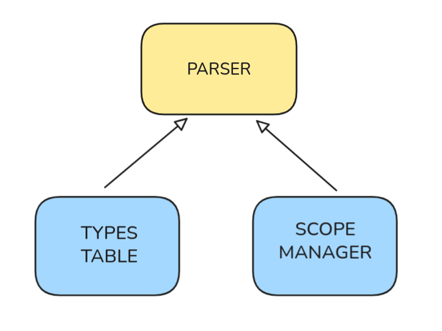
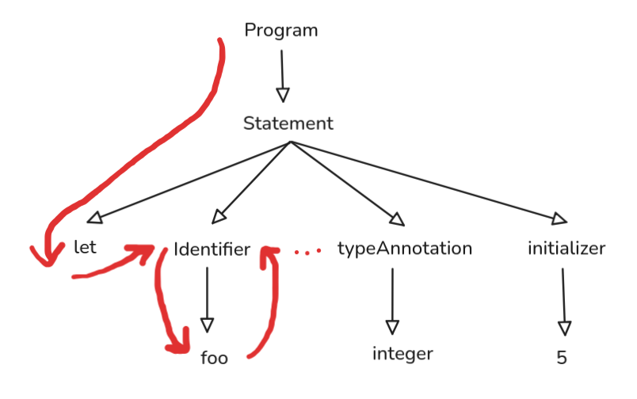
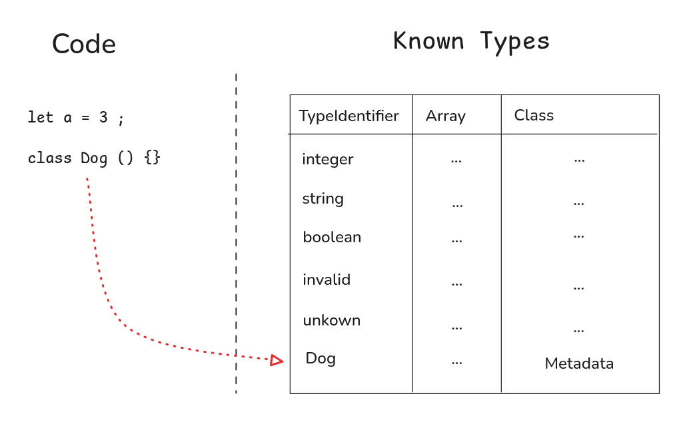
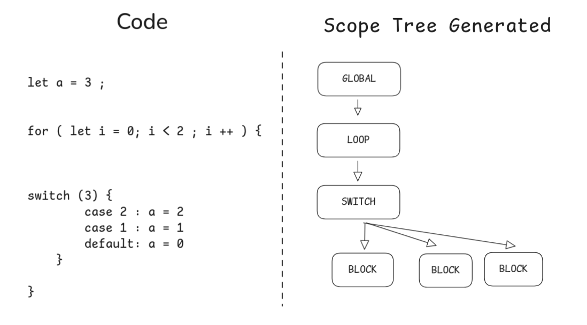

<div>
    <h1 align="center"> 5318008Lang ⚛️</h1>
    <h3 align="center"> 
        Don't understand the reference? 
        <a href="https://www.youtube.com/watch?v=r4w2XUqxcBk">Watch this</a>
    </h3>
</div>

[](https://github.com/ElrohirGT/5318008Lang/actions/workflows/go.yml)


## How to develop this project

Honestly? You only need a Go compiler. But if you need anything else, we
recommend [Nix](https://nixos.org/download/) and
[Flakes](https://nixos.wiki/wiki/flakes)! Then you can simply run:

```bash
nix develop # Enters a devshell with a go compiler and other goodies (like a debugger)
```

Once you have your environment ready, you can run the project with:

```bash
go run .

go test ./...
```

**Want to change the grammar?**

For that, you should have [antlr4](https://github.com/antlr/antlr4) installed.
Once its ready, modify the file `compiscript/program/Compiscript.g4` and run
this command in the root of the repo:

```bash
antlr4 -Dlanguage=Go -Xexact-output-dir -o ./parser compiscript/program/Compiscript.g4
```

**Running the vscode extension**

This projects offers a vscode extension developed for compiling the compiscript
grammar. For runnning locally the extension just use the following commad:

```bash
cd vscode-extension/5318008-lang/
```

And the press ´F5´

Also to see the changes of the Go code in the extension use the following
command from the root directory:

```bash
go build -o vscode-extension/5318008-lang/bin/compiscript-analyzer main.go
```

### Fuzzing

Fuzzing has been implemented, checkout for fuzz tests under the
`./tests/fuzzTests/` folder. You can only run one test at a time with:

```bash
go test ./tests/fuzzTests/random_bytes/ -fuzz=Fuzz
```

Specifying the folder test directory each time! Make sure to run them from the
root of the repository.

## 📘 Project Structure

```
.
├── compiscript     // Gramar language definition
├── parser          // Parser module (Generated with ANTLR)
├── listener        // The CORE
├── lib             // Utility function an types
├── tests           // Tests for the diff
└── gui             // Awesome GUI ✨
```

## 🧪 Testing

Almost all project tests are defined under the directory `./tests/`. Every file
you find here is divided in two:

```
// Basic CPS file
let a: string = "Hola";
---
// Expected compiler output
```

When you execute `go test` it executes a single test that reads all these files
and compares the output of the compiler with the expected output defined below
the `---`, if this differ in any way it reports an error. Easy way to get a big
pile of tests going.

### Linting

To lint the project simply run:

```bash
golangci-lint run ./...
```

## ✨ Documentation

### Semantic Analysis

This phase of the code follows the lexical which mean: "The code follows the
desired structure, but does it actually make sense?" In this phase we check
primarily for correctnes in 2 aspects:

- **Types**
- **Scopes**

But the check for those we first need to define how our program represents them,
and interact with the code. In this phase this are the primary modules:



#### Parsing



#### Types



https://github.com/ElrohirGT/5318008Lang/blob/2d8a431ba2d278083dc29979e8506ecb80713d71/listener/types.go#L14-L38

#### Scopes



https://github.com/ElrohirGT/5318008Lang/blob/0c25ba6a11598954a7c940915e75ad4d569bfbd9/listener/scopes.go#L45-L62

### TAC Generation

This phase attempts to generate an Intermediate Representation of the code. We
need the type checker and semantic analysis to end successfully, if not this
phase cannot be run. Therefore it contains a bunch of checks to see if the
previous two phases completed with success.

The following structure represents the final program in TAC format:

https://github.com/ElrohirGT/5318008Lang/blob/8769ca38b85e435295e5d54c3c96e3c69eb713a2/tac_generator/instructions.go#L410-L416

Each scope saves the following information about itself:

https://github.com/ElrohirGT/5318008Lang/blob/8769ca38b85e435295e5d54c3c96e3c69eb713a2/tac_generator/instructions.go#L402-L408

Only `Instructions` is used on the final TAC generation step. Each instruction
contains its own field and struct, later combined into a single "enum":

https://github.com/ElrohirGT/5318008Lang/blob/8769ca38b85e435295e5d54c3c96e3c69eb713a2/tac_generator/instructions.go#L316-L334

#### Translate between scopes and variables

Each scope has a translation dictionary with priority and inherits all other
translations from it's father. When we want to check if a value needs to be
loaded into a new register or if an existing variable already holds the value of
this expression, we check this dictionary. The basic function below illustrates
this point:

https://github.com/ElrohirGT/5318008Lang/blob/8769ca38b85e435295e5d54c3c96e3c69eb713a2/tac_generator/instructions.go#L479-L513

### TAC Documentation

- Tipos de Datos:
  - En MIPS solamente hay 3 tipos de datos:
    - BYTE
    - HALFWORD
    - WORD
  - Por lo que en nuestro TAC tenemos:
    - i8, i16, i32
    - u8, u16, u32
- Asignación (=)
  - = t1 i32 5
  - = t2 u1 1
  - = <variable> <tipo> <valor>
- Copiar (CP)
  - CP t1 t2
  - CP <variable> <variable>
- Salto Incondicional (GOTO \<sección/tag>)
- Salto Condicional:
  - IF <variable> GOTO \<sección/tag>
  - IF NOT <variable> GOTO \<sección/tag>
- Llamadas a procedimientos y retornos:
  - PARAM <variable>
  - LOAD <variable>
  - CALL <procedure> \<# params>
  - CALLRET <variable> <procedure> \<#params>
  - RETURN <variable>
- Arrays/Objetos:
  - Crear un array:
    - ALLOC <variable> <size>
  - Acceder a un elemento:
    - LWO <variable> \<array/objeto> <offset>
  - Asignar a un elemento:
    - SWO \<array/objeto> <offset> <valor>
  - Destruir:
    - FREE <variable>
- Asignaciones de Direcciones:
  - Obtener dirección (&)
  - Obtener valor de dirección (@)
- Secciones/Tags:
  - SEC <name of section>
    - Padding of child instructions is required (for legibility)
  - FUNC <name of section>
    - Padding of child instructions is required (for legibility)
- Comentarios:
  - // <contenido comentario>
    - Solamente abarcan una línea

#### Operaciones

- ADD <destiny> <v1> <v2>
- SUB <destiny> <minuendo> <sustraendo>
- MULT<destiny> <v1> <v2>
- DIV <destiny> <dividendo> <divisor>
- AND <destiny> <a> <b>
- OR <destiny> <a> <b>
- NOT <destiny> <a> <b>
- GT <destiny> <a> <b>
- GTE <destiny> <a> <b>
- LT <destiny> <a> <b>
- LTE <destiny> <a> <b>
- EQ <destiny> <a> <b>

### Booleans

- True: Cualquier cosa que no sea 0.
- False: 0x0

#### TAC Example

The directory `./tests/TAC_generation/` contains a bunch of this examples that
also serve as snapshots for testing, but here's a very basic one:

```
// Compiscript source code
let a = [1,1,1];
let b = a[0];
---
// Generated TAC
ALLOC t1 12
SWO t1 0 1
SWO t1 4 1
SWO t1 8 1
LWO t2 t1 0
= t3 i32 t2
```
